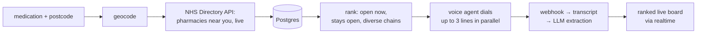

# Relay

**We made an AI agent that checks prescription medication availability for you.**

Patients facing medicine shortages ring 30–40 pharmacies by hand. Relay does the ringing: enter a medication and a postcode, and a voice agent **really phones** the open pharmacies near you — in parallel — and streams honest, timestamped verdicts onto a live board.

> Built in 48 hours for a hackathon. On the morning of submission it made its first genuine calls: seven London pharmacies for `W2 2DS` (an area we never pre-loaded), three real verdicts, then fourteen Manchester pharmacies for `M1 2AB`. The logs are in [`evidence/`](evidence/).

## How it works



- **National coverage:** every search pulls the searched area's pharmacies from the NHS Directory of Healthcare Services at search time — no pre-seeded city list.
- **The calls are real.** An ElevenLabs conversational agent (Claude Haiku, British manner, hard honesty rules) asks whether the branch has the medication in stock. It listens before speaking, presses IVR menu keys, waits patiently through "let me check", and always discloses being an AI when asked.
- **Verdicts are honest by construction.** A pharmacy that never picked up is *never* a stock verdict — database constraints make an unverified "in stock" row impossible, not just unlikely. Ranked buckets: in stock → can order → out of stock → unreached/unverified.

## Politeness invariants (the product dies without them)

All enforced inside one advisory-locked claim function in Postgres — nowhere else, so they cannot drift:

| Rule | Value |
|---|---|
| Lines in flight per search | ≤ 3 |
| Global concurrent calls | ≤ 8 |
| Same phone number | once per hour, ever |
| Closed pharmacies | never dialed (Europe/London hours, must stay open ≥ 60 min) |
| Attempts per search | ≤ 12, then the search settles |
| Unanswered ring | abandoned at 60 s |
| Search lifetime | settles in ≤ 15 min |

## Architecture in one sentence

Postgres is the single source of truth; small commands (`lib/commands/`, one file each) are the only writers; the UI is a projection over realtime. Every politeness rule lives in one advisory-locked SQL claim; every past bug became a named test.

## Stack

| Piece | Used for |
|---|---|
| **ElevenLabs** Conversational AI | the outbound voice agent (Claude Haiku + "Mark" voice, DTMF, voicemail detection) |
| **Supabase** | Postgres + RLS + realtime board + pg_cron watchdog |
| **Vercel** | Next.js 16 App Router, the deployed product |
| **NHS DoHS API v3** | live pharmacy directory per search (names, real phone numbers, opening hours) |
| **OpenAI** | transcript → structured verdict extraction (re-runnable; raw transcripts are append-only truth) |
| Google Maps, postcodes.io | the live board map and geocoding |

## Run it

```bash
npm install
cp .env.example .env.local   # fill in the keys it names
npx supabase start           # local stack (ports 555xx)
npx supabase migration up
npm run dev
```

`npm test` runs 160+ unit/integration tests (integration suites skip when the local stack is down). Without API keys the app still runs: `/search?engine=sim` is an explicit client-side simulation, and dialing is disabled unless `DIAL_MODE` and provider keys are configured.

## Honesty section

- The public default (`/search`) is the **real** pipeline. The simulation exists only behind `?engine=sim` and labels itself "Demo mode — simulated data."
- `DEV_TEST` mode rerouted 100+ development calls to our own phones through the full real stack (agent, telephony, webhooks, extraction) before the first real pharmacy was ever dialed. Those fixtures (`FAKE*` / `dev_test` rows) never mix with real mode — pool isolation is enforced at every layer and tested.
- Patient privacy: a postcode is all we ever collect. No accounts, no names, no prescription details. The agent holds no patient information. Raw transcripts never reach the browser.
- Known issue we're honest about: a search whose 12-attempt ceiling is spent idles until its deadline instead of settling immediately (found live on the Manchester run; fix is a one-clause change to `settle_if_drained`, post-submission).
- Relay checks stock availability — it is not medical advice. In an emergency call 999; for urgent medicine needs call NHS 111.

## AI usage

This project was pair-built with **Claude Code** (Claude Fable 5) across the 48 hours — architecture, commands, tests, and reviews, plus two independent adversarial audits run by a second model (GPT‑5.6). Human decisions (Marvin): product calls, every criterion change, all real-call approvals, and agent conversation rulings from listening to live transcripts.
