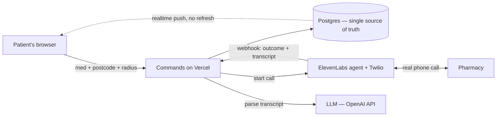
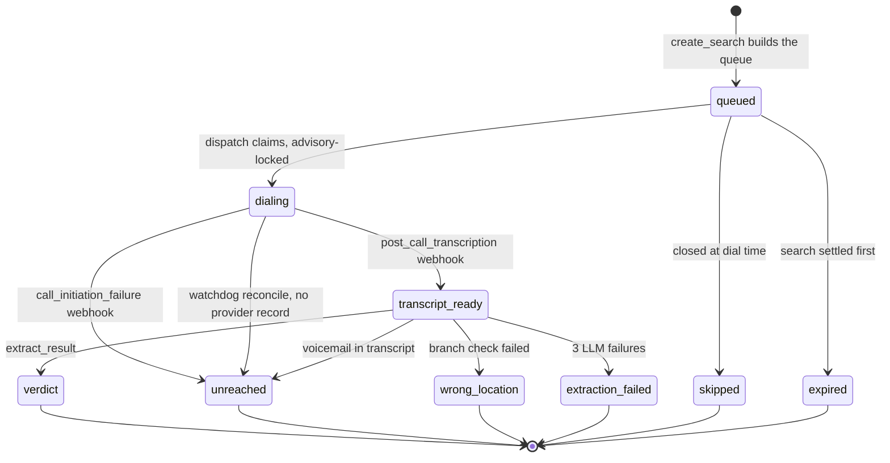

# MedFind — Architecture

> Repo-canonical version of the architecture (the rendered artifact at
> https://claude.ai/code/artifact/f0a43665-e165-42a2-a329-b0ee9ea793cd is Marvin's viewing copy;
> in-session, THIS file is the truth). Terminology: see CONTEXT.md.

## The golden rule

**Postgres is the single source of truth · small commands are the only writers · the UI is a projection.**
Every call is a row with exactly one status; commands are stateless functions (wake on trigger → touch tables → exit). When something breaks, the stuck row's status names the guilty file in `lib/commands/`.

## System context

## Commands (one file each in `lib/commands/`)

| Command | Wakes up when | Job | Never |
|---|---|---|---|
| `create_search` | user clicks Search | validate med · geocode · rank ALL open pharmacies (portfolio score) · queue top 6, rest = bench · copy <1h cached verdicts · zero open → show next opening times | dials |
| `dispatch` | search created · any call terminal · watchdog | ONE claim inside `pg_advisory_xact_lock`: ≤3/search, ≤GLOBAL_CAP(8), 1-hour number rule, open now (Europe/London), search active, fairness (fewest in-flight first) · dead call → promote next bench pharmacy · snapshot dial_mode + numbers · POST to ElevenLabs · mark `dialing` | interprets |
| `record_call_event` | ElevenLabs webhook | verify HMAC (ALWAYS 200 — even on failure, log-and-drop; a 5xx streak trips provider auto-disable) · body cap 1MB · persist raw_body before parsing · dedupe · advance status · `waitUntil()`: dispatch + extract + settle | interprets |
| `extract_result` | transcript stored | stored transcript → OpenAI `gpt-5.4-mini` (escalate `gpt-5.6-sol` after 2 schema failures; 3rd failure → terminal `extraction_failed`, honest bucket 4) → verdict + rank bucket · fan-out to waiting same-pharmacy+med rows | dials |
| `settle_search` | any call terminal · watchdog | no pending calls OR 20 min elapsed → search complete + leftover `queued` children → `expired` | cancels in-flight calls |
| `seed_pharmacies` | manual, build time | NHS/manual list → normalize (E.164, hours sessions) → upsert by ODSCode | runs during a search |
| `check_capacity` | search form (P2, likely cut) | read-only queue-wait estimate | writes |

## Call state machine (v3 — provider-observable transitions only, NO retries)

Key facts: there is NO "answered" event — only `call_initiation_failure` (never connected) and `post_call_transcription` (everything else); voicemail and wrong-branch are decided from the transcript by `extract_result`. Every dead-end is terminal; the **bench** (next-ranked pharmacy) replaces it — the same number is never redialed within the hour.

**Rank buckets** (type-enforced by DB constraints): 1 in stock (any amount — partial stock still bucket 1, shown as "1 box — you need 2") → 2 orderable by soonest ETA → 3 no stock → 4 unreached/unverified ("couldn't reach", NEVER a stock verdict). Buckets 1–3 require `status='verdict'` + `location_confirmed='yes'` — the database rejects everything else (see `scripts/prove-constraints.sql`, 13 forbidden states).

## Event model (no polling)

| Thing to notice | How we find out | Latency |
|---|---|---|
| Call ended with conversation | `post_call_transcription` webhook | instant |
| Call busy/never answered | `call_initiation_failure` webhook | instant |
| Slot freed → next call | webhook handler invokes dispatch | instant |
| Verdict → screen | Supabase realtime push | instant |
| Bench promotion · 1-hour lapse | claim-query predicate, evaluated on every event | seconds |
| Dead-quiet timeout · lost webhook | **watchdog**: Supabase `pg_cron` per-minute (Vercel Hobby cron is daily-only!) — reconcile stale in-flight via `GET /v1/convai/conversations/{id}`, re-run stuck extractions, settle dead searches; every action logged to `anomalies` | ≤59s |

Post-200 webhook work MUST run in `waitUntil()` — Vercel doesn't guarantee execution after the response otherwise.

## ElevenLabs + Twilio (verified endpoints)

- Outbound: `POST https://api.elevenlabs.io/v1/convai/twilio/outbound-call`, header `xi-api-key`; body: `agent_id`, `agent_phone_number_id`, `to_number` (E.164), `conversation_initiation_client_data.dynamic_variables` — carries `call_ref` (OUR calls.id; webhooks correlate by this, never by hoping conversation_id got saved) + `{{pharmacy_name}}/{{street}}/{{medication}}/{{quantity_needed}}` for the templated greeting/branch check. Returns `conversation_id` + `callSid`.
- Webhooks: `post_call_transcription` + `call_initiation_failure` (failure_reason busy/no-answer/unknown), HMAC header `ElevenLabs-Signature` (`t=<unix>,v0=<hmac-sha256 of "t.body">`, 30-min tolerance).
- Agent tools: DTMF keypad (IVR nav, ≤2 menu levels; voice store-pickers → bail as `national_line`), voicemail detection (end call, no message), end call. 30s ring, 5-min budget.
- Concurrency: Creator plan = 10 concurrent workspace-wide (incl. dashboard test calls) → `GLOBAL_CAP=8` headroom. Over-cap rejection → row back to `queued` (recoverable). Twilio: ~1 new call/sec origination; concurrency effectively unbounded; billing from answer (voicemail pickup = answered = billed → the opening-hours rule is a money rule).

## Who gets called (portfolio, not proximity)

Radius = candidate pool. Step 1 throw-out: closed now or closing within 1h → never called. Step 2 score survivors: own call/verdict history 0.35 · size proxy (weekly hours span) 0.25 · proximity 0.25 · answered-before 0.15. Step 3 constrained pick: ≤2 per ownership group, ≥2 independents, ≥1 supermarket where available (same chain = same wholesaler = correlated stockouts). Call top 6 (3 lines at once), promote from bench on any dead call, ~12-attempt ceiling. The 1-hour politeness rule doubles as a verdict cache (same pharmacy+med <1h → verdict copied, timestamped honestly).

## Capacity math (3.5-min avg calls, user-confirmed)

First result ≈ 4 min · 6 answered ≈ 8–10 min · 20-min ÷ 3.5 ≈ 5 waves × 3 = ~15 dial slots max/search · cost ≈ $0.35–0.40/completed call, $2–3/search · at cap 8: ~2.3 calls/min ≈ ~22 searches/hr, ~7 simultaneous before overload.

## When it breaks

| Symptom | Guilty command | Look at |
|---|---|---|
| 0 pharmacies queued | create_search | geocoding · radius · hours filter |
| stuck `queued` | dispatch | the claim query — caps, 1-hour rule |
| stuck `dialing` | record_call_event | webhook delivery → watchdog reconcile · provider config |
| frozen board, zero new call_events | webhook delivery | HMAC secret after redeploy / auto-disable — alarm "calls in flight, no events 5 min" |
| transcript saved, no verdict | extract_result | LLM/schema — replay the stored transcript |
| stuck `transcript_ready` | extract_result | watchdog re-invokes; 3 fails → extraction_failed |
| verdicts in DB, screen frozen | projection | realtime subscription / RLS owner |
| wrong branch named | greeting + extract_result | transcript + location_confirmed + DTMF events |
| search never finishes | settle_search | watchdog |
| pharmacy data wrong | seed_pharmacies | ingest/verification — never the search path |

## Security/privacy

Anonymous sign-in (`signInAnonymously`) + `searches.owner` + RLS owner-scoped reads; raw transcripts excluded from client column grants; call_events/dial_log/anomalies have NO client access. Postcode only, no PII. Rate limit: 1 active search per identity/IP. `INTERNAL_SECRET` header on internal routes. `DIALING_ENABLED` kill switch inside the claim path. DEV_TEST reroutes dials to team phones via `resolveDialNumber()` ONLY — politeness rules never bypassed; fake 24/7 seed pharmacies do the work; mode flip cancels all non-terminal rows.

## Design history

Adversarially reviewed pre-build by two independent models (Claude Fable subagent + codex `gpt-5.6-sol` @ xhigh) — 8 core agreements adopted; phase-0 code re-reviewed twice more. Reports: `docs/review/`.
